# Buyer Portal サイトマップ（src-vbizhw）

- **対象リポジトリ**: `src-vbizhw`（Buyer Portal）
- **Base Path**: `/eProcurement`（別: `/CatalogMall`, `/SSO/SAML/IDP`）
- **抽出元**: `src/router.js` + `src/modules/*/router.js`（Vue Router定義）
- **総ルート数**: 約250件

> 各ページのHTMLモックアップは本フォルダ（`projects/standard/documents/design/buyer/`）に
> ルート名（Name列）をファイル名として配置する想定。配置後、下表の「HTML」列がリンクとして機能する。

---

## 1. モジュール構成図

```mermaid
graph TD
    Root["/eProcurement"]

    Root --> Auth[Authentication<br/>認証]
    Root --> Home[Home / Punchout]
    Root --> Buyer[Buyer<br/>発注業務]
    Root --> BM[BuyerMaster<br/>設定・マスタ]
    Root --> CM["/CatalogMall<br/>カタログモール"]
    Root --> Sch[Schedule<br/>ジョブ管理]
    Root --> Sup[Supplier<br/>サプライヤ業務]

    Buyer --> AnkenHangover[案件引継ぎ]
    Buyer --> Contract[契約・請求]
    Buyer --> Order[発注]
    Buyer --> Estimate[見積]
    Buyer --> Purchaser[購買担当]
    Buyer --> Requester[依頼者]
    Buyer --> Inventory[在庫]
    Buyer --> Approver[承認]
    Buyer --> BillPayment[支払申請]
    Buyer --> ReportCenter[レポートセンター]

    BM --> PayClose[支払締め]
    BM --> MasterMgmt[マスタ管理]
    BM --> MailTpl[メールテンプレート]
    BM --> ApprovalSet[承認設定]
    BM --> HelpMgmt[ヘルプ管理]
    BM --> InvoiceMgmt[インボイス管理]

    Sup --> SupTrans[取引ステータス一覧]
    Sup --> SupEstimate[見積対応]
    Sup --> SupInvoice[請求]
```

---

## 2. モジュール別ページ一覧

### 2.1 Authentication（認証）

| Path | Name | 補足 | HTML |
|---|---|---|---|
| /eProcurement/Login | eProcurement_Login | ログイン（未認証） | [eProcurement_Login.html](./eProcurement_Login.html) |
| /eProcurement/authorized | eProcurement_Authorized | 認可コールバック（未認証） | [eProcurement_Authorized.html](./eProcurement_Authorized.html) |
| /eProcurement/Logout | eProcurement_Logout | ログアウト（未認証） | [eProcurement_Logout.html](./eProcurement_Logout.html) |
| /eProcurement/PasswordChange | eProcurement_PasswordChange | パスワード変更 | [eProcurement_PasswordChange.html](./eProcurement_PasswordChange.html) |
| /eProcurement/ProfileSetting | eProcurement_ProfileSetting | プロフィール設定 | [eProcurement_ProfileSetting.html](./eProcurement_ProfileSetting.html) |
| /eProcurement/InitiatePunchout/:punchoutCode | initiate_punchout | Punchout開始（未認証） | [initiate_punchout.html](./initiate_punchout.html) |
| /SSO/SAML/IDP/:registrationId | SSO_SAML_IDP | SAML SSO（未認証） | [SSO_SAML_IDP.html](./SSO_SAML_IDP.html) |

### 2.2 共通・Home

| Path | Name | 補足 | HTML |
|---|---|---|---|
| /eProcurement/Home | eProcurement_Home | ホーム | [eProcurement_Home.html](./eProcurement_Home.html) |
| /eProcurement/HomeAriba | eProcurement_Home_Ariba | Aribaホーム | [eProcurement_Home_Ariba.html](./eProcurement_Home_Ariba.html) |
| /eProcurement/Punchout | eProcurement_Punchout | Punchout | [eProcurement_Punchout.html](./eProcurement_Punchout.html) |
| /eProcurement/qlik | eProcurement_qlik | データアナライザ | [eProcurement_qlik.html](./eProcurement_qlik.html) |
| /eProcurement/PageNotFound | eProcurement_PageNotFound | 404 | [eProcurement_PageNotFound.html](./eProcurement_PageNotFound.html) |
| /eProcurement/PageNotPermission | eProcurement_PageNotPermission | 権限なし | [eProcurement_PageNotPermission.html](./eProcurement_PageNotPermission.html) |

### 2.3 Buyer — 案件引継ぎ（AnkenHangover）

| Path | Name | HTML |
|---|---|---|
| /eProcurement/AnkenHangoverReq/ValidAnken_Requester | eProcurement_AnkenHangoverReq_ValidAnken_Requester | [link](./eProcurement_AnkenHangoverReq_ValidAnken_Requester.html) |
| /eProcurement/AnkenHangoverReq/NeedToUpdate_InvalidRequester | eProcurement_AnkenHangoverReq_NeedToUpdate_InvalidRequester | [link](./eProcurement_AnkenHangoverReq_NeedToUpdate_InvalidRequester.html) |
| /eProcurement/AnkenHangoverReq/NeedToPullback_InvalidApprover_Req | eProcurement_AnkenHangoverReq_NeedToPullback_InvalidApprover | [link](./eProcurement_AnkenHangoverReq_NeedToPullback_InvalidApprover.html) |
| /eProcurement/AnkenHangoverApv/ValidAnken_Approver | eProcurement_AnkenHangoverApv_ValidAnken_Approver | [link](./eProcurement_AnkenHangoverApv_ValidAnken_Approver.html) |
| /eProcurement/AnkenHangoverApv/NeedToPullback_InvalidApprover_Apv | eProcurement_AnkenHangoverApv_NeedToPullback_InvalidApprover | [link](./eProcurement_AnkenHangoverApv_NeedToPullback_InvalidApprover.html) |
| /eProcurement/AnkenHangoverPurchaser/ValidAnkenPurchaser | eProcurement_AnkenHangover_ValidAnken_Purchaser | [link](./eProcurement_AnkenHangover_ValidAnken_Purchaser.html) |
| /eProcurement/AnkenHangoverPurchaser/NeedToUpdateInvalidPurchaser | eProcurement_AnkenHangover_NeedToUpdate_InvalidPurchaser | [link](./eProcurement_AnkenHangover_NeedToUpdate_InvalidPurchaser.html) |
| /eProcurement/AnkenHangoverPurchaser/NeedToPullbackInvalidApproverPurchaser | eProcurement_AnkenHangoverPurchaser_NeedToPullback_InvalidApprover | [link](./eProcurement_AnkenHangoverPurchaser_NeedToPullback_InvalidApprover.html) |
| /eProcurement/AnkenHangover/PurchaserInfoChangeInput | eProcurement_AnkenHangover_PurchaserInfoChangeInput | [link](./eProcurement_AnkenHangover_PurchaserInfoChangeInput.html) |
| /eProcurement/AnkenHangover/RequesterInfoChangeInput | eProcurement_AnkenHangover_RequesterInfoChangeInput | [link](./eProcurement_AnkenHangover_RequesterInfoChangeInput.html) |
| /eProcurement/AnkenHangover/ApproverInfoChangeInput | eProcurement_AnkenHangover_ApproverInfoChangeInput | [link](./eProcurement_AnkenHangover_ApproverInfoChangeInput.html) |

### 2.4 Buyer — 契約・支払（Contract / Payment）

| Path | Name | HTML |
|---|---|---|
| /eProcurement/Payment/All | eProcurement_Payment_List_All | [link](./eProcurement_Payment_List_All.html) |
| /eProcurement/Payment/Confirmation | eProcurement_Payment_List_Confirmation | [link](./eProcurement_Payment_List_Confirmation.html) |
| /eProcurement/Payment/ConfirmationCompleted | eProcurement_Payment_List_Confirmation_Completed | [link](./eProcurement_Payment_List_Confirmation_Completed.html) |
| /eProcurement/Payment/TemporarySave | eProcurement_PaymentApplication_Management_Temporary_Save | [link](./eProcurement_PaymentApplication_Management_Temporary_Save.html) |
| /eProcurement/PaymentApproval | eProcurement_Payment_Approval | [link](./eProcurement_Payment_Approval.html) |
| /eProcurement/PaymentConfirm | eProcurement_Payment_Confirm | [link](./eProcurement_Payment_Confirm.html) |
| /eProcurement/PaymentDone | eProcurement_Payment_Confirm_Done | [link](./eProcurement_Payment_Confirm_Done.html) |
| /eProcurement/Invoice | eProcurement_Payment_Invoice | [link](./eProcurement_Payment_Invoice.html) |
| /eProcurement/Contract/All | eProcurement_Settings_Contract_All | [link](./eProcurement_Settings_Contract_All.html) |
| /eProcurement/Contract/ContractPendingApproval | eProcurement_Settings_Contract_Pending_Approval | [link](./eProcurement_Settings_Contract_Pending_Approval.html) |
| /eProcurement/Contract/ContractApproved | eProcurement_Settings_Contract_Approved | [link](./eProcurement_Settings_Contract_Approved.html) |
| /eProcurement/Contract/ContractFinished | eProcurement_Settings_Contract_Finished | [link](./eProcurement_Settings_Contract_Finished.html) |
| /eProcurement/Contract/ContractDraft | eProcurement_Settings_Contract_Draft | [link](./eProcurement_Settings_Contract_Draft.html) |
| /eProcurement/Contract/Input | eProcurement_Contract_Info_Register_Input | [link](./eProcurement_Contract_Info_Register_Input.html) |
| /eProcurement/Contract/SelectApproval | eProcurement_Contract_Select_Approval | [link](./eProcurement_Contract_Select_Approval.html) |
| /eProcurement/Contract/ConfirmInput | eProcurement_Contract_Confirm_Input | [link](./eProcurement_Contract_Confirm_Input.html) |
| /eProcurement/Contract/ApplyCompleted | eProcurement_Contract_Apply_Complete | [link](./eProcurement_Contract_Apply_Complete.html) |

### 2.5 Buyer — 発注（Order / DirectOrder）

| Path | Name | HTML |
|---|---|---|
| /eProcurement/DirectOrder/Input | eProcurement_DirectOrder_Input | [link](./eProcurement_DirectOrder_Input.html) |
| /eProcurement/DirectOrder/ApproverSelection | eProcurement_DirectOrder_ApproverSelection | [link](./eProcurement_DirectOrder_ApproverSelection.html) |
| /eProcurement/DirectOrder/Confirmation | eProcurement_DirectOrder_Confirmation | [link](./eProcurement_DirectOrder_Confirmation.html) |
| /eProcurement/DirectOrder/Completion | eProcurement_DirectOrder_Completion | [link](./eProcurement_DirectOrder_Completion.html) |
| /eProcurement/Order/Input | eProcurement_Order_Input | [link](./eProcurement_Order_Input.html) |
| /eProcurement/Order/ApproverSelection | eProcurement_Order_ApproverSelection | [link](./eProcurement_Order_ApproverSelection.html) |
| /eProcurement/Order/Confirmation | eProcurement_Order_Confirmation | [link](./eProcurement_Order_Confirmation.html) |
| /eProcurement/Order/Completion | eProcurement_Order_Completion | [link](./eProcurement_Order_Completion.html) |
| /eProcurement/Order/PastOrderReference | eProcurement_Past_Order_Reference | [link](./eProcurement_Past_Order_Reference.html) |

### 2.6 Buyer — 見積（Estimate / EstimateOrder）

| Path | Name | HTML |
|---|---|---|
| /eProcurement/Estimate/Input | eProcurement_Estimate_Input | [link](./eProcurement_Estimate_Input.html) |
| /eProcurement/Estimate/DestinationInput | eProcurement_Estimate_DestinationInput | [link](./eProcurement_Estimate_DestinationInput.html) |
| /eProcurement/Estimate/ConfirmInput | eProcurement_Estimate_ConfirmInput | [link](./eProcurement_Estimate_ConfirmInput.html) |
| /eProcurement/Estimate/ApplicationCompleted | eProcurement_Estimate_ApplicationCompleted | [link](./eProcurement_Estimate_ApplicationCompleted.html) |
| /eProcurement/Estimate/PastAcquiredQuotationReference | eProcurement_Estimate_PastAcquiredQuotationReference | [link](./eProcurement_Estimate_PastAcquiredQuotationReference.html) |
| /eProcurement/EstimateOrder/Input | eProcurement_EstimateOrder_Input | [link](./eProcurement_EstimateOrder_Input.html) |
| /eProcurement/EstimateOrder/OrderEdit | eProcurement_EstimateOrder_OrderEdit | [link](./eProcurement_EstimateOrder_OrderEdit.html) |
| /eProcurement/EstimateOrder/ApproverSelection | eProcurement_EstimateOrder_ApproverSelection | [link](./eProcurement_EstimateOrder_ApproverSelection.html) |
| /eProcurement/EstimateOrder/Confirmation | eProcurement_EstimateOrder_Confirmation | [link](./eProcurement_EstimateOrder_Confirmation.html) |
| /eProcurement/EstimateOrder/Completion | eProcurement_EstimateOrder_Completion | [link](./eProcurement_EstimateOrder_Completion.html) |
| /eProcurement/EstimateOrder/ApplicationInformationShow | eProcurement_EstimateOrder_ApplicationInformationShow | [link](./eProcurement_EstimateOrder_ApplicationInformationShow.html) |
| /eProcurement/EstimateDocumentPdf | eProcurement_Estimate_Document_Pdf | [link](./eProcurement_Estimate_Document_Pdf.html) |

### 2.7 Buyer — 購買担当（Purchaser）

| Path | Name | HTML |
|---|---|---|
| /eProcurement/EstimatePurchaser/AnswerInput | eProcurement_EstimatePurchaser_EstimateAnswerInput | [link](./eProcurement_EstimatePurchaser_EstimateAnswerInput.html) |
| /eProcurement/EstimatePurchaser/AnswerInputCompletion | eProcurement_EstimatePurchaser_EstimateAnswerInputCompletion | [link](./eProcurement_EstimatePurchaser_EstimateAnswerInputCompletion.html) |
| /eProcurement/EstimatePurchaser/AnswerRefuse | eProcurement_Purchaser_EstimateAnswerRefuse | [link](./eProcurement_Purchaser_EstimateAnswerRefuse.html) |
| /eProcurement/EstimatePurchaser/AnswerShow | eProcurement_EstimatePurchaser_EstimateAnswerShow | [link](./eProcurement_EstimatePurchaser_EstimateAnswerShow.html) |
| /eProcurement/Purchaser/PersonInChargeUndecided | eProcurement_Purchaser_PersonInChargeUndecided | [link](./eProcurement_Purchaser_PersonInChargeUndecided.html) |
| /eProcurement/Purchaser/BeforeNegotiation | eProcurement_Purchaser_BeforeNegotiation | [link](./eProcurement_Purchaser_BeforeNegotiation.html) |
| /eProcurement/Purchaser/UnderNegotiation | eProcurement_Purchaser_UnderNegotiation | [link](./eProcurement_Purchaser_UnderNegotiation.html) |
| /eProcurement/Purchaser/Answered | eProcurement_Purchaser_Answered | [link](./eProcurement_Purchaser_Answered.html) |
| /eProcurement/Purchaser/ProjectInCharge | eProcurement_Purchaser_ProjectInCharge | [link](./eProcurement_Purchaser_ProjectInCharge.html) |
| /eProcurement/Purchaser/AllProject | eProcurement_Purchaser_AllProject | [link](./eProcurement_Purchaser_AllProject.html) |
| /eProcurement/Purchaser/EstimateRequestDetail | eProcurement_Purchaser_EstimateRequestDetail | [link](./eProcurement_Purchaser_EstimateRequestDetail.html) |
| /eProcurement/Purchaser/ComparisonToEstimate | eProcurement_Purchaser_ComparisonToEstimate | [link](./eProcurement_Purchaser_ComparisonToEstimate.html) |
| /eProcurement/Purchaser/SelectionNotificationInput | eProcurement_Purchaser_SelectionNotificationInput | [link](./eProcurement_Purchaser_SelectionNotificationInput.html) |
| /eProcurement/Purchaser/ApproveDestinationInput | eProcurement_Purchaser_ApproveDestinationInput | [link](./eProcurement_Purchaser_ApproveDestinationInput.html) |
| /eProcurement/Purchaser/ConfirmContentsInput | eProcurement_Purchaser_ConfirmContentsInput | [link](./eProcurement_Purchaser_ConfirmContentsInput.html) |
| /eProcurement/Purchaser/Input | eProcurement_Purchaser_Input | [link](./eProcurement_Purchaser_Input.html) |
| /eProcurement/Purchaser/ApproverSelection | eProcurement_Purchaser_Approver_Selection | [link](./eProcurement_Purchaser_Approver_Selection.html) |
| /eProcurement/Purchaser/Confirmation | eProcurement_Purchaser_Confirmation | [link](./eProcurement_Purchaser_Confirmation.html) |
| /eProcurement/Purchaser/ReApplicantOldSupplier | eProcurement_Purchaser_ReApplicantOldSupplier | [link](./eProcurement_Purchaser_ReApplicantOldSupplier.html) |
| /eProcurement/Purchaser/ApplicantNewSupplier | eProcurement_Purchaser_ApplicantNewSupplier | [link](./eProcurement_Purchaser_ApplicantNewSupplier.html) |
| /eProcurement/PurchaserApprover/EstimateResults | eProcurement_PurchaserApprover_EstimateResults | [link](./eProcurement_PurchaserApprover_EstimateResults.html) |
| /eProcurement/PurchaserApprover/EstimateResultsComplete | eProcurement_PurchaserApprover_EstimateResults_Complete | [link](./eProcurement_PurchaserApprover_EstimateResults_Complete.html) |
| /eProcurement/PurchaserApprover/EstimateRequests | eProcurement_PurchaserApprover_EstimateRequests | [link](./eProcurement_PurchaserApprover_EstimateRequests.html) |
| /eProcurement/Trading/SwitchUser | eProcurement_Trading_SwitchUser | [link](./eProcurement_Trading_SwitchUser.html) |
| /eProcurement/Trading/OrderDataUpload | eProcurement_Trading_OrderDataUpload | [link](./eProcurement_Trading_OrderDataUpload.html) |

### 2.8 Buyer — 依頼者（Requester）

| Path | Name | HTML |
|---|---|---|
| /eProcurement/Requester/EstimateApplicationApplicantList | eProcurement_Requester_EstimateApplicationApplicantList | [link](./eProcurement_Requester_EstimateApplicationApplicantList.html) |
| /eProcurement/Requester/All | eProcurement_Requester_All | [eProcurement_Requester_All.html](./eProcurement_Requester_All.html) |
| /eProcurement/Requester/Ordered | eProcurement_Requester_Ordered | [link](./eProcurement_Requester_Ordered.html) |
| /eProcurement/Requester/WaitingAcceptance | eProcurement_Requester_WaitingAcceptance | [link](./eProcurement_Requester_WaitingAcceptance.html) |
| /eProcurement/Requester/FinishedAcceptance | eProcurement_Requester_FinishedAcceptance | [link](./eProcurement_Requester_FinishedAcceptance.html) |
| /eProcurement/Requester/OpportunityDraft | eProcurement_Requester_OpportunityDraft | [link](./eProcurement_Requester_OpportunityDraft.html) |
| /eProcurement/Requester/HistorySentFax | eProcurement_Requester_HistorySentFax | [link](./eProcurement_Requester_HistorySentFax.html) |
| /eProcurement/Requester/AcceptanceInput | eProcurement_Requester_AcceptanceInput | [link](./eProcurement_Requester_AcceptanceInput.html) |
| /eProcurement/Requester/Correction | eProcurement_Requester_Correction | [link](./eProcurement_Requester_Correction.html) |
| /eProcurement/Requester/ApproveRequest | eProcurement_Requester_ApproveRequest | [link](./eProcurement_Requester_ApproveRequest.html) |
| /eProcurement/Requester/ApproveRequestCompletion | eProcurement_Requester_ApproveRequestCompletion | [link](./eProcurement_Requester_ApproveRequestCompletion.html) |
| /eProcurement/Requester/MonthlyDownloadAnkenDetail | eProcurement_Requester_MonthlyDownloadAnkenDetail | [link](./eProcurement_Requester_MonthlyDownloadAnkenDetail.html) |
| /eProcurement/Requester/MonthlyDownloadAnkenDetailTrading | eProcurement_Requester_MonthlyDownloadAnkenDetailTrading | [link](./eProcurement_Requester_MonthlyDownloadAnkenDetailTrading.html) |
| /eProcurement/Requester/EstimateRequestInfo | eProcurement_Requester_EstimateRequestInfo | [link](./eProcurement_Requester_EstimateRequestInfo.html) |
| /eProcurement/Requester/CompletionSeftEstimate | eProcurement_Requester_CompletionSelfEstimate | [link](./eProcurement_Requester_CompletionSelfEstimate.html) |
| /eProcurement/Requester/DownloadUpdatedMaster | download_updated_master | [link](./download_updated_master.html) |
| /eProcurement/Requester/OrderDataUpload | trading_uppload_order | [link](./trading_uppload_order.html) |
| /eProcurement/Requester/ReferenceFile | eProcurement_Requester_ReferenceFile | [link](./eProcurement_Requester_ReferenceFile.html) |
| /eProcurement/Requester/Catalog/AnswerInput | eProcurement_CatalogSupplier_CatalogAnswerInput | [link](./eProcurement_CatalogSupplier_CatalogAnswerInput.html) |
| /eProcurement/Requester/Catalog/AnswerInputCompletion | eProcurement_CatalogSupplier_CatalogAnswerInputCompletion | [link](./eProcurement_CatalogSupplier_CatalogAnswerInputCompletion.html) |
| /eProcurement/Requester/UploadOrderITOHam | Upload_Order_ITOHam | [link](./Upload_Order_ITOHam.html) |
| /eProcurement/Requester/UploadOrderITOHamHistory | Upload_Order_ITOHam_History | [link](./Upload_Order_ITOHam_History.html) |

### 2.9 Buyer — 在庫（Inventory）

| Path | Name | HTML |
|---|---|---|
| /eProcurement/Inventory/Control | eProcurement_InventoryControl | [link](./eProcurement_InventoryControl.html) |
| /eProcurement/Inventory/Receipt | eProcurement_Inventory_Receipt | [link](./eProcurement_Inventory_Receipt.html) |
| /eProcurement/Inventory/ReceiptCompleted | eProcurement_Inventory_ReceiptCompleted | [link](./eProcurement_Inventory_ReceiptCompleted.html) |
| /eProcurement/Inventory/Undeliveried | eProcurement_Inventory_Issue | [link](./eProcurement_Inventory_Issue.html) |
| /eProcurement/Inventory/Warehousing | eProcurement_Inventory_IssueCompleted | [link](./eProcurement_Inventory_IssueCompleted.html) |
| /eProcurement/Inventory/ManagementWork | eProcurement_Inventory_ManagementWork | [link](./eProcurement_Inventory_ManagementWork.html) |
| /eProcurement/Inventory/ManagementWorkCompleted | eProcurement_Inventory_ManagementWorkCompleted | [link](./eProcurement_Inventory_ManagementWorkCompleted.html) |
| /eProcurement/Inventory/ApproveRequest | eProcurement_Inventory_ApproveRequest | [link](./eProcurement_Inventory_ApproveRequest.html) |
| /eProcurement/Inventory/ScheduleDeliveryInput | eProcurement_Inventory_PayOutInput | [link](./eProcurement_Inventory_PayOutInput.html) |
| /eProcurement/Inventory/ScheduleDeliveryConfirm | eProcurement_Inventory_ScheduleDeliveryConfirm | [link](./eProcurement_Inventory_ScheduleDeliveryConfirm.html) |
| /eProcurement/Inventory/Approver/Order | eProcurement_Inventory_OrderApproval | [link](./eProcurement_Inventory_OrderApproval.html) |
| /eProcurement/Inventory/Approver/Acceptance | eProcurement_Inventory_AcceptanceApproval | [link](./eProcurement_Inventory_AcceptanceApproval.html) |
| /eProcurement/Inventory/CompleteInventoryOrderApprove | eProcurement_Approver_CompleteInventoryOrder | [link](./eProcurement_Approver_CompleteInventoryOrder.html) |
| /eProcurement/Inventory/CompleteInventoryAcceptanceApprove | eProcurement_Approver_CompleteInventoryAcceptance | [link](./eProcurement_Approver_CompleteInventoryAcceptance.html) |
| /eProcurement/Inventory/ApproverSelection | eProcurement_Inventory_Supplier_Order_ApproverSelection | [link](./eProcurement_Inventory_Supplier_Order_ApproverSelection.html) |
| /eProcurement/Inventory/SupplierOrderConfirmation | eProcurement_Inventory_Supplier_Order_Confirmation | [link](./eProcurement_Inventory_Supplier_Order_Confirmation.html) |
| /eProcurement/Inventory/SupplierOrderInput | eProcurement_Inventory_Supplier_Order_Input | [link](./eProcurement_Inventory_Supplier_Order_Input.html) |
| /eProcurement/Inventory/ShelfQuantity/CorrectionInput | eProcurement_Inventory_Shelf_Quantity_Correction_Input | [link](./eProcurement_Inventory_Shelf_Quantity_Correction_Input.html) |
| /eProcurement/Inventory/ShelfQuantity/ApproverSelection | eProcurement_Inventory_Shelf_Quantity_ApproverSelection | [link](./eProcurement_Inventory_Shelf_Quantity_ApproverSelection.html) |
| /eProcurement/Inventory/ShelfQuantity/CorrectionInputConfirmation | eProcurement_Inventory_Shelf_Quantity_Correction_Input_Confirmation | [link](./eProcurement_Inventory_Shelf_Quantity_Correction_Input_Confirmation.html) |
| /eProcurement/Inventory/ShelfQuantity/CorrectionInputCompletion | eProcurement_Inventory_Shelf_Quantity_Correction_Input_Completion | [link](./eProcurement_Inventory_Shelf_Quantity_Correction_Input_Completion.html) |
| /eProcurement/Inventory/ProductInput | eProcurement_Inventory_ProductRegist | [link](./eProcurement_Inventory_ProductRegist.html) |
| /eProcurement/Inventory/InventoryInput | eProcurement_Inventory_InventoryRegist | [link](./eProcurement_Inventory_InventoryRegist.html) |

### 2.10 Buyer — 承認（Approver）

| Path | Name | HTML |
|---|---|---|
| /eProcurement/Approver/EstimateApproval | eProcurement_Approver_EstimateApproval | [link](./eProcurement_Approver_EstimateApproval.html) |
| /eProcurement/Approver/OrderApproval | eProcurement_Approver_OrderApproval | [link](./eProcurement_Approver_OrderApproval.html) |
| /eProcurement/Approver/ApproverContract | eProcurement_Approver_Contract_Tab | [link](./eProcurement_Approver_Contract_Tab.html) |
| /eProcurement/Approver/AcceptanceApproval | eProcurement_Approver_AcceptanceApproval | [link](./eProcurement_Approver_AcceptanceApproval.html) |
| /eProcurement/Approver/PaymentApproval | eProcurement_Approver_PaymentApproval | [link](./eProcurement_Approver_PaymentApproval.html) |
| /eProcurement/Approver/ApprovalComplete | eProcurement_Approver_ApprovalComplete | [link](./eProcurement_Approver_ApprovalComplete.html) |
| /eProcurement/Approver/ApproveResult | eProcurement_Approver_ApproveResult | [link](./eProcurement_Approver_ApproveResult.html) |
| /eProcurement/PurchaseOrderApproval | eProcurement_Approver_PurchaseOrderApproval | [link](./eProcurement_Approver_PurchaseOrderApproval.html) |
| /eProcurement/PurchaseAcceptanceApproval | eProcurement_Approver_PurchaseAcceptanceApproval | [link](./eProcurement_Approver_PurchaseAcceptanceApproval.html) |
| /eProcurement/CompletePurchaseOrder | eProcurement_Approver_CompletePurchaseOrder | [link](./eProcurement_Approver_CompletePurchaseOrder.html) |
| /eProcurement/CompleteContractOrder | eProcurement_Approver_CompleteContractOrder | [link](./eProcurement_Approver_CompleteContractOrder.html) |
| /eProcurement/CompletePurchaseAcceptance | eProcurement_Approver_CompletePurchaseAcceptance | [link](./eProcurement_Approver_CompletePurchaseAcceptance.html) |
| /eProcurement/CompletePayment | eProcurement_Approver_CompletePayment | [link](./eProcurement_Approver_CompletePayment.html) |
| /eProcurement/EstimateAnswerShow | eProcurement_Approver_EstimateAnswerShow | [link](./eProcurement_Approver_EstimateAnswerShow.html) |
| /eProcurement/EstimateAnswerShowMergeOrder | eProcurement_Approver_EstimateAnswerShowMergeOrder | [link](./eProcurement_Approver_EstimateAnswerShowMergeOrder.html) |

### 2.11 Buyer — 支払申請 / その他（BillPaymentApplication, Budget, SupplierProhibition ほか）

| Path | Name | HTML |
|---|---|---|
| /eProcurement/BillPaymentApplication/Input | eProcurement_PaymentApplication_Input | [link](./eProcurement_PaymentApplication_Input.html) |
| /eProcurement/BillPaymentApplication/ApprovalInput | eProcurement_PaymentApplication_Approve | [link](./eProcurement_PaymentApplication_Approve.html) |
| /eProcurement/BillPaymentApplication/Confirm | eProcurement_PaymentApplication_Confirm | [link](./eProcurement_PaymentApplication_Confirm.html) |
| /eProcurement/BillPaymentApplication/Completed | eProcurement_PaymentApplication_Completed | [link](./eProcurement_PaymentApplication_Completed.html) |
| /eProcurement/BillPaymentApplication/Edit | eProcurement_PaymentApplication_Edit | [link](./eProcurement_PaymentApplication_Edit.html) |
| /eProcurement/BillPaymentApplication/isAwaiting/Input | eProcurement_PaymentApplication_isAwating_Input | [link](./eProcurement_PaymentApplication_isAwating_Input.html) |
| /eProcurement/BillPaymentApplication/InputSupplier | eProcurement_PaymentApplication_Input_Supplier | [link](./eProcurement_PaymentApplication_Input_Supplier.html) |
| /eProcurement/BillPaymentApplication/InputSupplier/Completed | eProcurement_PaymentApplication_Input_Supplier_Completed | [link](./eProcurement_PaymentApplication_Input_Supplier_Completed.html) |
| /eProcurement/Budget/Inquiry | eProcurement_BudgetInquiry | [link](./eProcurement_BudgetInquiry.html) |
| /eProcurement/RelatedAnken | eProcurement_RelatedAnken | [link](./eProcurement_RelatedAnken.html) |
| /eProcurement/SupplierProhibition/AntiCompanyJudgment | anti_Company_Judgment | [link](./anti_Company_Judgment.html) |
| /eProcurement/SupplierProhibition/NonTradeableSuppliersList | non_Tradeable_Suppliers_List | [link](./non_Tradeable_Suppliers_List.html) |
| /eProcurement/SupplierNonTrading/RequestQuotation | eProcurement_SupplierNonTrading_Request_Quotation | [link](./eProcurement_SupplierNonTrading_Request_Quotation.html) |
| /eProcurement/SupplierNonTrading/OrderApplied | eProcurement_SupplierNonTrading_Order_Applied | [link](./eProcurement_SupplierNonTrading_Order_Applied.html) |
| /eProcurement/SupplierNonTrading/QuoteSelected | eProcurement_SupplierNonTrading_Quote_Selected | [link](./eProcurement_SupplierNonTrading_Quote_Selected.html) |
| /eProcurement/SupplierNonTrading/CompletedDelivery | eProcurement_SupplierNonTrading_Completed_Delivery | [link](./eProcurement_SupplierNonTrading_Completed_Delivery.html) |
| /eProcurement/AnkenVersionCancel | eProcurement_Buyer_Anken_Version_Cancel | [link](./eProcurement_Buyer_Anken_Version_Cancel.html) |
| /eProcurement/ReportCenter/Home | eProcurement_ReportCenter_Home | [link](./eProcurement_ReportCenter_Home.html) |
| /eProcurement/ReportCenter/DownloadHistory | eProcurement_ReportCenter_DownloadHistory | [link](./eProcurement_ReportCenter_DownloadHistory.html) |
| /eProcurement/CMMasterDirection | CM_master_direction | [link](./CM_master_direction.html) |

### 2.12 BuyerMaster — 支払締め（PaymentClosing）

| Path | Name | HTML |
|---|---|---|
| /eProcurement/Settings/PaymentClosing/PaymentClosingExecute | eProcurement_Settings_PaymentClosing_PaymentClosingExecute | [link](./eProcurement_Settings_PaymentClosing_PaymentClosingExecute.html) |
| /eProcurement/Settings/PaymentClosing/PaymentClosingExecuteDateRegister | eProcurement_Settings_PaymentClosing_PaymentClosingExecuteDateRegister | [link](./eProcurement_Settings_PaymentClosing_PaymentClosingExecuteDateRegister.html) |
| /eProcurement/Settings/PaymentClosing/History | eProcurement_Settings_PaymentClosing_History | [link](./eProcurement_Settings_PaymentClosing_History.html) |
| /eProcurement/Settings/PaymentClosing/PaymentClosingExecuteDetail/:companyDisplayCode/:companyGroupDisplayCode/:targetMonthly | eProcurement_Settings_PaymentClosing_PaymentClosingExecuteDetail | [link](./eProcurement_Settings_PaymentClosing_PaymentClosingExecuteDetail.html) |
| /eProcurement/Settings/PaymentClosing/PaymentClosingExecuteBuyerDetail/:companyDisplayCode/:companyGroupDisplayCode/:targetMonthly | eProcurement_Settings_PaymentClosing_PaymentClosingExecuteDetailWithStatus | [link](./eProcurement_Settings_PaymentClosing_PaymentClosingExecuteDetailWithStatus.html) |
| /eProcurement/Settings/PaymentClosing/MonthlyDownloadAnkenDetail | eProcurement_Settings_PaymentClosing_MonthlyDownloadAnkenDetail | [link](./eProcurement_Settings_PaymentClosing_MonthlyDownloadAnkenDetail.html) |
| /eProcurement/Settings/PaymentClosingBuyer/PaymentClosingExecuteDateRegister | eProcurement_Settings_PaymentClosing_PaymentClosingExecuteDateBuyerRegister | [link](./eProcurement_Settings_PaymentClosing_PaymentClosingExecuteDateBuyerRegister.html) |
| /eProcurement/Settings/PaymentClosingBuyer/PaymentClosingExecute | eProcurement_Settings_PaymentClosing_PaymentClosingExecuteBuyer | [link](./eProcurement_Settings_PaymentClosing_PaymentClosingExecuteBuyer.html) |
| /eProcurement/Settings/PaymentClosingBuyer/History | eProcurement_Settings_PaymentClosing_HistoryBuyer | [link](./eProcurement_Settings_PaymentClosing_HistoryBuyer.html) |
| /eProcurement/Settings/PaymentClosingTrading/PaymentClosingExecuteTrading | eProcurement_Settings_PaymentClosing_PaymentClosingExecute_Trading | [link](./eProcurement_Settings_PaymentClosing_PaymentClosingExecute_Trading.html) |
| /eProcurement/PaymentManagementBuyer | eProcurement_Buyer_PaymentManagement | [link](./eProcurement_Buyer_PaymentManagement.html) |
| /eProcurement/PaymentManagementBuyerDetail | eProcurement_Buyer_PaymentManagementDetail | [link](./eProcurement_Buyer_PaymentManagementDetail.html) |
| /eProcurement/Settings/Payment/PlanConfirm/:contractHeaderCode | eProcurement_Payment_Plan_Confirm | [link](./eProcurement_Payment_Plan_Confirm.html) |

### 2.13 BuyerMaster — マスタ管理・メールテンプレート

| Path | Name | HTML |
|---|---|---|
| /eProcurement/Settings/MasterManagement/UploadHistory | eProcurement_Settings_MasterManagement_UploadHistory | [link](./eProcurement_Settings_MasterManagement_UploadHistory.html) |
| /eProcurement/Settings/MasterManagement/MasterSettingItem | eProcurement_Settings_MasterManagement_MasterSettingItem | [link](./eProcurement_Settings_MasterManagement_MasterSettingItem.html) |
| /eProcurement/Settings/MasterManagement/MasterDataDetail/:masterType/:masterDataType | eProcurement_Settings_MasterManagement_MasterDataDetail | [link](./eProcurement_Settings_MasterManagement_MasterDataDetail.html) |
| /eProcurement/Settings/MasterManagement/MasterSetting | eProcurement_Settings_MasterManagement_MasterSetting | [link](./eProcurement_Settings_MasterManagement_MasterSetting.html) |
| /eProcurement/Settings/MasterManagement/EstimateTemplate | eProcurement_Settings_MasterManagement_EstimateTemplate | [link](./eProcurement_Settings_MasterManagement_EstimateTemplate.html) |
| /eProcurement/Settings/MasterManagement/DetailAutoEstimate | eProcurement_Settings_MasterManagement_DetailAutoEstimate | [link](./eProcurement_Settings_MasterManagement_DetailAutoEstimate.html) |
| /eProcurement/Settings/MasterManagement/MasterDataDetail/DirectTradingManagementDetail | eProcurement_Settings_DirectTradingManagementDetail | [link](./eProcurement_Settings_DirectTradingManagementDetail.html) |
| /eProcurement/Settings/MasterManagement/SearchDictionary | eProcurement_Settings_MasterManagement_SearchDictionary | [link](./eProcurement_Settings_MasterManagement_SearchDictionary.html) |
| /eProcurement/Settings/Mail/TemplateManagementCommon | eProcurement_Settings_Mail_TemplateManagementCommon | [link](./eProcurement_Settings_Mail_TemplateManagementCommon.html) |
| /eProcurement/Settings/Mail/TemplateManagementPrivate | eProcurement_Settings_Mail_TemplateManagementPrivate | [link](./eProcurement_Settings_Mail_TemplateManagementPrivate.html) |
| /eProcurement/Settings/Mail/TemplateManagementDetail (new) | eProcurement_Settings_Mail_TemplateManagementDetail_New | [link](./eProcurement_Settings_Mail_TemplateManagementDetail_New.html) |
| /eProcurement/Settings/Mail/TemplateManagementDetail/:id (common edit) | eProcurement_Settings_Mail_TemplateManagementDetail_Common_Edit | [link](./eProcurement_Settings_Mail_TemplateManagementDetail_Common_Edit.html) |
| /eProcurement/Settings/Mail/TemplateManagementDetail/:id (private edit) | eProcurement_Settings_Mail_TemplateManagementDetail_Private_Edit | [link](./eProcurement_Settings_Mail_TemplateManagementDetail_Private_Edit.html) |

### 2.14 BuyerMaster — 承認設定・ヘルプ管理

| Path | Name | HTML |
|---|---|---|
| /eProcurement/Settings/ApprovalSetting/ApprovalSettingList | eProcurement_Settings_ApprovalSetting_ApprovalSettingList | [link](./eProcurement_Settings_ApprovalSetting_ApprovalSettingList.html) |
| /eProcurement/Settings/ApprovalSetting/ApprovalSettingDetail/:comGroupCode (new) | eProcurement_Settings_ApprovalSetting_ApprovalSettingDetail_New | [link](./eProcurement_Settings_ApprovalSetting_ApprovalSettingDetail_New.html) |
| /eProcurement/Settings/ApprovalSetting/ApprovalSettingDetail/:comGroupCode/:code (edit) | eProcurement_Settings_ApprovalSetting_ApprovalSettingDetail_Edit | [link](./eProcurement_Settings_ApprovalSetting_ApprovalSettingDetail_Edit.html) |
| /eProcurement/Settings/ApprovalSetting/ApprovalSettingRuleEdit/:comGroupCode/:code | eProcurement_Settings_ApprovalSetting_ApprovalSettingRuleEdit | [link](./eProcurement_Settings_ApprovalSetting_ApprovalSettingRuleEdit.html) |
| /eProcurement/Settings/ApprovalSetting/OrganizationApprovalSetting | eProcurement_Settings_ApprovalSetting_OrganizationApprovalSetting | [link](./eProcurement_Settings_ApprovalSetting_OrganizationApprovalSetting.html) |
| /eProcurement/HelpManagement/Admin/HelpDeskList | eProcurement_HelpManagement_HelpDeskList | [link](./eProcurement_HelpManagement_HelpDeskList.html) |
| /eProcurement/HelpManagement/Admin/HelpDeskSystemDetail | eProcurement_HelpManagement_HelpDeskSystemDetail | [link](./eProcurement_HelpManagement_HelpDeskSystemDetail.html) |
| /eProcurement/HelpManagement/Admin/InquiryInputCompleted | eProcurement_HelpManagement_InquiryInputCompleted | [link](./eProcurement_HelpManagement_InquiryInputCompleted.html) |
| /eProcurement/HelpManagement/Admin/HelpDeskSystemList | eProcurement_HelpManagement_HelpDeskSystemList | [link](./eProcurement_HelpManagement_HelpDeskSystemList.html) |
| /eProcurement/HelpManagement/BuyerGroupAdmin/HelpDeskList | eProcurement_BuyerGroupAdmin_HelpManagment_HelpDeskList | [link](./eProcurement_BuyerGroupAdmin_HelpManagment_HelpDeskList.html) |
| /eProcurement/HelpManagement/BuyerGroupAdmin/HelpDeskDetail (new) | eProcurement_BuyerGroupAdmin_HelpManagment_HelpDeskDetail_New | [link](./eProcurement_BuyerGroupAdmin_HelpManagment_HelpDeskDetail_New.html) |
| /eProcurement/HelpManagement/BuyerGroupAdmin/HelpDeskDetail (edit) | eProcurement_BuyerGroupAdmin_HelpManagment_HelpDeskDetail_Edit | [link](./eProcurement_BuyerGroupAdmin_HelpManagment_HelpDeskDetail_Edit.html) |
| /eProcurement/Settings/HelpManagement/HelpDeskSystemList | eProcurement_Settings_HelpManagment_HelpDeskSystemList | [link](./eProcurement_Settings_HelpManagment_HelpDeskSystemList.html) |

### 2.15 BuyerMaster — 予算・マスタ承認・インボイス・その他設定

| Path | Name | HTML |
|---|---|---|
| /eProcurement/Budget/Management | eProcurement_BudgetManagement | [link](./eProcurement_BudgetManagement.html) |
| /eProcurement/MasterApproval/MasterApprovalSettingRuleEdit | eProcurement_Settings_ApprovalSetting_MasterApprovalSettingRuleEdit | [link](./eProcurement_Settings_ApprovalSetting_MasterApprovalSettingRuleEdit.html) |
| /eProcurement/MasterApproval/MasterApprovalApplicationList | eProcurement_Settings_ApprovalSetting_MasterApprovalApplicationList | [link](./eProcurement_Settings_ApprovalSetting_MasterApprovalApplicationList.html) |
| /eProcurement/applicantList | eProcurement_Master_ApplicantList | [link](./eProcurement_Master_ApplicantList.html) |
| /eProcurement/applicantDetail/:id | eProcurement_Master_Applicant_Detail | [link](./eProcurement_Master_Applicant_Detail.html) |
| /eProcurement/InvoiceManagement/BeforeClosingDate | eProcurement_InvoiceManagement_Before_Closing_Date | [link](./eProcurement_InvoiceManagement_Before_Closing_Date.html) |
| /eProcurement/InvoiceManagement/AfterClosingDate | eProcurement_InvoiceManagement_After_Closing_Date | [link](./eProcurement_InvoiceManagement_After_Closing_Date.html) |
| /eProcurement/InvoiceManagement/List | eProcurement_InvoiceManagement_List | [link](./eProcurement_InvoiceManagement_List.html) |
| /eProcurement/InvoiceDetail | eProcurement_InvoiceManagement_Detail | [link](./eProcurement_InvoiceManagement_Detail.html) |
| /eProcurement/EstimateMarginSetting/Management | eProcurement_EstimateMarginSettingManagement | [link](./eProcurement_EstimateMarginSettingManagement.html) |
| /eProcurement/EstimateMarginSettingRegistration/Management | eProcurement_EstimateMarginSettingRegistration | [link](./eProcurement_EstimateMarginSettingRegistration.html) |
| /eProcurement/TaxDiffTolerance | eProcurement_Settings_TaxDiffTolerance | [link](./eProcurement_Settings_TaxDiffTolerance.html) |
| /eProcurement/ReportCenter/Settings | eProcurement_ReportCenter_Settings | [link](./eProcurement_ReportCenter_Settings.html) |
| /eProcurement/DataMapping/History | eProcurement_DataMapping_EventLog | [link](./eProcurement_DataMapping_EventLog.html) |
| /eProcurement/DataMapping/Main | eProcurement_DataMapping_Main | [link](./eProcurement_DataMapping_Main.html) |

### 2.16 CatalogMall

| Path | Name | HTML |
|---|---|---|
| /CatalogMall/ProductsCompare | CatalogMall_Products_Compare | [link](./CatalogMall_Products_Compare.html) |
| /CatalogMall/MyCatalogue_Entry | CatalogMall_My_Catalog | [link](./CatalogMall_My_Catalog.html) |
| /CatalogMall/ShoppingCart | CatalogMall_Shopping_Cart | [link](./CatalogMall_Shopping_Cart.html) |
| /CatalogMall/KeywordSearch_V2Entry | CM008KeywordSearchEntry | [link](./CM008KeywordSearchEntry.html) |
| /CatalogMall/Subscription_Entry | CatalogMall_Subscription_Entry | [link](./CatalogMall_Subscription_Entry.html) |
| /CatalogMall/ProductDetail | CatalogMall_Product_Detail | [link](./CatalogMall_Product_Detail.html) |
| /CatalogMall/Catalogue_Entry | CatalogMall_Catalogue_Entry | [link](./CatalogMall_Catalogue_Entry.html) |
| /CatalogMall/HistoryEntry | CatalogMall_History_Entry | [link](./CatalogMall_History_Entry.html) |
| /CatalogMall/PunchoutHistoryEntry | CatalogMall_Punchout_History_Entry | [link](./CatalogMall_Punchout_History_Entry.html) |
| /CatalogMall/CatalogPunchoutSend | CatalogMall_Catalog_Punchout_Send | [link](./CatalogMall_Catalog_Punchout_Send.html) |
| /CatalogMall/PharmaKeywordSearchEntry | PharmaKeywordSearchEntry | [link](./PharmaKeywordSearchEntry.html) |

### 2.17 Schedule

| Path | Name | HTML |
|---|---|---|
| /eProcurement/Settings/ScheduleJob/ScheduleList | eProcurement_Settings_ScheduleJob_List | [link](./eProcurement_Settings_ScheduleJob_List.html) |
| /eProcurement/Settings/ScheduleJob/ScheduleDetail | eProcurement_Settings_ScheduleJob_Detail | [link](./eProcurement_Settings_ScheduleJob_Detail.html) |

### 2.18 Supplier（Buyer PortalからのRead-only参照）

| Path | Name | HTML |
|---|---|---|
| /eProcurement/Supplier/All | eProcurement_Supplier_All | [link](./eProcurement_Supplier_All.html) |
| /eProcurement/Supplier/TemporaryEstimate | eProcurement_Supplier_TemporaryEstimate | [link](./eProcurement_Supplier_TemporaryEstimate.html) |
| /eProcurement/Supplier/AcceptingOrder | eProcurement_Supplier_AcceptingOrder | [link](./eProcurement_Supplier_AcceptingOrder.html) |
| /eProcurement/Supplier/WaitingDelivery | eProcurement_Supplier_WaitingDelivery | [link](./eProcurement_Supplier_WaitingDelivery.html) |
| /eProcurement/Supplier/CompletedDelivery | eProcurement_Supplier_CompletedDelivery | [link](./eProcurement_Supplier_CompletedDelivery.html) |
| /eProcurement/Supplier/CompletedAcceptance | eProcurement_Supplier_CompletedAcceptance | [link](./eProcurement_Supplier_CompletedAcceptance.html) |
| /eProcurement/Supplier/SupplierDetail | eProcurement_Supplier_Detail | [link](./eProcurement_Supplier_Detail.html) |
| /eProcurement/Supplier/AcceptingOrderCompletion | eProcurement_Supplier_AcceptingOrderCompletion | [link](./eProcurement_Supplier_AcceptingOrderCompletion.html) |
| /eProcurement/Supplier/WaitingDeliveryCompletion | eProcurement_Supplier_WaitingDeliveryCompletion | [link](./eProcurement_Supplier_WaitingDeliveryCompletion.html) |
| /eProcurement/Supplier/PaymentManagement | eProcurement_Supplier_PaymentManagement | [link](./eProcurement_Supplier_PaymentManagement.html) |
| /eProcurement/Supplier/PaymentManagementDetail | eProcurement_Supplier_PaymentManagementDetail | [link](./eProcurement_Supplier_PaymentManagementDetail.html) |
| /eProcurement/Supplier/PastOrderReferenceSupplier | eProcurement_Supplier_PastOrderReferenceSupplier | [link](./eProcurement_Supplier_PastOrderReferenceSupplier.html) |
| /eProcurement/Supplier/Invoice/All | eProcurement_Invoice_List_All | [link](./eProcurement_Invoice_List_All.html) |
| /eProcurement/Supplier/Invoice/Confirmation | eProcurement_Invoice_List_Confirmation | [link](./eProcurement_Invoice_List_Confirmation.html) |
| /eProcurement/Supplier/Invoice/ConfirmationCompleted | eProcurement_Invoice_List_Confirmation_Completed | [link](./eProcurement_Invoice_List_Confirmation_Completed.html) |
| /eProcurement/Supplier/Estimate/All | eProcurement_EstimateSupplier_All | [link](./eProcurement_EstimateSupplier_All.html) |
| /eProcurement/Supplier/Estimate/BeforeAnswer | eProcurement_EstimateSupplier_BeforeAnswer | [link](./eProcurement_EstimateSupplier_BeforeAnswer.html) |
| /eProcurement/Supplier/Estimate/AfterAnswer | eProcurement_EstimateSupplier_AfterAnswer | [link](./eProcurement_EstimateSupplier_AfterAnswer.html) |
| /eProcurement/Supplier/Estimate/AnswerInput | eProcurement_EstimateSupplier_EstimateAnswerInput | [link](./eProcurement_EstimateSupplier_EstimateAnswerInput.html) |
| /eProcurement/Supplier/Estimate/AnswerInputCompletion | eProcurement_EstimateSupplier_EstimateAnswerInputCompletion | [link](./eProcurement_EstimateSupplier_EstimateAnswerInputCompletion.html) |
| /eProcurement/Supplier/Estimate/AnswerRefuse | eProcurement_EstimateSupplier_EstimateAnswerRefuse | [link](./eProcurement_EstimateSupplier_EstimateAnswerRefuse.html) |
| /eProcurement/Supplier/Estimate/AnswerCompletion | eProcurement_EstimateSupplier_EstimateAnswerCompletion | [link](./eProcurement_EstimateSupplier_EstimateAnswerCompletion.html) |
| /eProcurement/Supplier/Estimate/AnswerShow | eProcurement_EstimateSupplier_EstimateAnswerShow | [link](./eProcurement_EstimateSupplier_EstimateAnswerShow.html) |
| /eProcurement/Supplier/Estimate/AnsweredQuotationReference | eProcurement_EstimateSupplier_AnsweredQuotationReference | [link](./eProcurement_EstimateSupplier_AnsweredQuotationReference.html) |
| /eProcurement/Supplier/AnkenVersionCancel | eProcurement_Supplier_Anken_Version_Cancel | [link](./eProcurement_Supplier_Anken_Version_Cancel.html) |
| /eProcurement/Supplier/SupplierPaymentInput | eProcurement_Supplier_Payment_Register_Input | [link](./eProcurement_Supplier_Payment_Register_Input.html) |
| /eProcurement/TradingHome | eProcurement_Home_JRTC | [link](./eProcurement_Home_JRTC.html) |

---

## 3. HTML配置ルール

- 本フォルダ（`projects/standard/documents/design/buyer/`）に、上表の **Name** をファイル名としたHTML（例: `eProcurement_Order_Input.html`）を直接配置する。
- 配置後、本サイトマップの該当行リンクがそのままモックアップへの導線になる。
