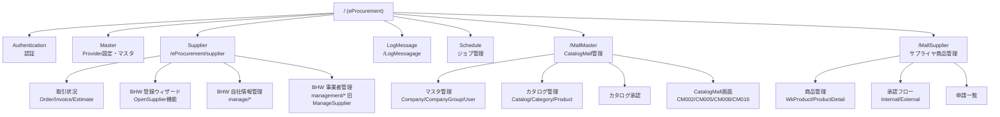

# Provider / Supplier Portal サイトマップ（src-vbizhw-common）

- **対象リポジトリ**: `src-vbizhw-common`（Provider / Supplier / CatalogMall / MallMaster / MallSupplier Portal）
- **URL Base Path**: `/`（J2/eProcurement）, `/MallMaster/`, `/MallSupplier/`
- **Company division codes**: `10`=Buyer, `20`=Supplier, `90`=Provider
- **抽出元**: 各モジュールの `router.js`（一部モジュールは独立routerを持たず、Supplier/MallMaster routerに埋め込み）
- **総ルート数**: 約300件

> 各ページのHTMLモックアップは本フォルダ（`projects/standard/documents/design/provider-supplier/`）に
> ルート名（Name列）をファイル名として配置する想定。配置後、下表の「HTML」列がリンクとして機能する。

> ⚠️ **注意**: `LogMessage` モジュールのURL Base Pathは実装上のtypoで `/LogMessagage` になっている（`src/modules/LogMessage/router.js`）。仕様書上は修正候補として記録するが、本サイトマップは実装に忠実に記載する。

---

## 1. モジュール構成図

---

## 2. モジュール別ページ一覧

### 2.1 Authentication（認証）

| Path | Name | 補足 | HTML |
|---|---|---|---|
| /eProcurement/Login | eProcurement_Login | ログイン（Provider） | [link](./eProcurement_Login.html) |
| /eProcurement/supplier-login | eProcurement_Supplier_Login | ログイン（Supplier） | [link](./eProcurement_Supplier_Login.html) |
| /eProcurement/provider-authorized | eProcurement_Provider_Authorized | 認可コールバック（Provider） | [link](./eProcurement_Provider_Authorized.html) |
| /eProcurement/supplier-authorized | eProcurement_Supplier_Authorized | 認可コールバック（Supplier） | [link](./eProcurement_Supplier_Authorized.html) |
| /eProcurement/Logout | eProcurement_Logout | ログアウト | [link](./eProcurement_Logout.html) |

### 2.2 共通（Root router）

| Path | Name | 補足 | HTML |
|---|---|---|---|
| /PageNotFound | - | 404（未認証） | [link](./PageNotFound.html) |
| /eProcurement/PageNotFound | - | 404（認証済） | [link](./eProcurement_PageNotFound.html) |
| /eProcurement/PageNotPermission | - | 権限なし | [link](./eProcurement_PageNotPermission.html) |

### 2.3 LogMessage（監査ログ）※Base Path typo: `/LogMessagage`

| Path | Name | HTML |
|---|---|---|
| /LogMessagage/Dashboard | LogMessage_Dashboard | [link](./LogMessage_Dashboard.html) |
| /LogMessagage/Detail | LogMessage_Detail | [link](./LogMessage_Detail.html) |

### 2.4 Master — 権限・マスタ管理（Provider設定）

| Path | Name | HTML |
|---|---|---|
| /eProcurement/Authorization/RoleManagement | eProcurement_Authorization_RoleManagement | [link](./eProcurement_Authorization_RoleManagement.html) |
| /eProcurement/Authorization/MasterPermission | eProcurement_Authorization_MasterPermission | [link](./eProcurement_Authorization_MasterPermission.html) |
| /eProcurement/Settings/Mail/TemplateManagementCommon | eProcurement_Settings_Mail_TemplateManagementCommon | [link](./eProcurement_Settings_Mail_TemplateManagementCommon.html) |
| /eProcurement/Settings/Mail/TemplateManagementPrivate | eProcurement_Settings_Mail_TemplateManagementPrivate | [link](./eProcurement_Settings_Mail_TemplateManagementPrivate.html) |
| /eProcurement/Settings/Mail/TemplateManagementDetail（新規） | eProcurement_Settings_Mail_TemplateManagementDetail_New | [link](./eProcurement_Settings_Mail_TemplateManagementDetail_New.html) |
| /eProcurement/Settings/Mail/TemplateManagementDetail/:id（共通編集） | eProcurement_Settings_Mail_TemplateManagementDetail_Common_Edit | [link](./eProcurement_Settings_Mail_TemplateManagementDetail_Common_Edit.html) |
| /eProcurement/Settings/Mail/TemplateManagementDetail/:id（個別編集） | eProcurement_Settings_Mail_TemplateManagementDetail_Private_Edit | [link](./eProcurement_Settings_Mail_TemplateManagementDetail_Private_Edit.html) |
| /eProcurement/Settings/MasterManagement/BuyerSwitch | eProcurement_Settings_MasterManagement_BuyerSwitch | [link](./eProcurement_Settings_MasterManagement_BuyerSwitch.html) |
| /eProcurement/Settings/MasterManagement/MasterSetting | eProcurement_Settings_MasterManagement_MasterSetting | [link](./eProcurement_Settings_MasterManagement_MasterSetting.html) |
| /eProcurement/Settings/MasterManagement/ProjectSettingList | eProcurement_Settings_MasterManagement_ProjectSetting | [link](./eProcurement_Settings_MasterManagement_ProjectSetting.html) |
| /eProcurement/Settings/MasterManagement/UploadHistory | eProcurement_Settings_MasterManagement_UploadHistory | [link](./eProcurement_Settings_MasterManagement_UploadHistory.html) |
| /eProcurement/Settings/MasterManagement/MasterSettingItem | eProcurement_Settings_MasterManagement_MasterSettingItem | [link](./eProcurement_Settings_MasterManagement_MasterSettingItem.html) |
| /eProcurement/Settings/MasterManagement/MasterDataDetail/:masterType/:masterDataType | eProcurement_Settings_MasterManagement_MasterDataDetail | [link](./eProcurement_Settings_MasterManagement_MasterDataDetail.html) |
| /eProcurement/Settings/MasterManagement/paymentSiteClosing | eProcurement_Settings_MasterManagement_PaymentSiteClosing | [link](./eProcurement_Settings_MasterManagement_PaymentSiteClosing.html) |
| /eProcurement/Settings/MasterManagement/PaymentSiteCondition | eProcurement_Settings_MasterManagement_PaymentSiteCondition | [link](./eProcurement_Settings_MasterManagement_PaymentSiteCondition.html) |
| /eProcurement/Settings/MasterManagement/PaymentSiteDate | eProcurement_Settings_MasterManagement_PaymentSiteDate | [link](./eProcurement_Settings_MasterManagement_PaymentSiteDate.html) |
| /eProcurement/Settings/MasterManagement/MasterDataDetail/DirectTradingManagementDetail | eProcurement_Settings_DirectTradingManagementDetail | [link](./eProcurement_Settings_DirectTradingManagementDetail.html) |
| /eProcurement/Settings/MultiLanguage/Management | eProcurement_Settings_MultiLanguage_Management | [link](./eProcurement_Settings_MultiLanguage_Management.html) |
| /eProcurement/Settings/MultiLanguage/Setting | eProcurement_Settings_Language_Management | [link](./eProcurement_Settings_Language_Management.html) |
| /eProcurement/billone | eProcurement_Bill_One_demo | [link](./eProcurement_Bill_One_demo.html) |

### 2.5 Schedule

| Path | Name | HTML |
|---|---|---|
| /eProcurement/Settings/ScheduleJob/ScheduleList | eProcurement_Settings_ScheduleJob_List | [link](./eProcurement_Settings_ScheduleJob_List.html) |
| /eProcurement/Settings/ScheduleJob/ScheduleDetail | eProcurement_Settings_ScheduleJob_Detail | [link](./eProcurement_Settings_ScheduleJob_Detail.html) |

### 2.6 Supplier — 取引状況（受注/請求/見積）

| Path | Name | HTML |
|---|---|---|
| /eProcurement/supplier/All | eProcurement_Supplier_All | [link](./eProcurement_Supplier_All.html) |
| /eProcurement/supplier/TemporaryEstimate | eProcurement_Supplier_TemporaryEstimate | [link](./eProcurement_Supplier_TemporaryEstimate.html) |
| /eProcurement/supplier/AcceptingOrder | eProcurement_Supplier_AcceptingOrder | [link](./eProcurement_Supplier_AcceptingOrder.html) |
| /eProcurement/supplier/WaitingDelivery | eProcurement_Supplier_WaitingDelivery | [link](./eProcurement_Supplier_WaitingDelivery.html) |
| /eProcurement/supplier/CompletedDelivery | eProcurement_Supplier_CompletedDelivery | [link](./eProcurement_Supplier_CompletedDelivery.html) |
| /eProcurement/supplier/CompletedAcceptance | eProcurement_Supplier_CompletedAcceptance | [link](./eProcurement_Supplier_CompletedAcceptance.html) |
| /eProcurement/supplier/SupplierDetail | eProcurement_Supplier_Detail | [link](./eProcurement_Supplier_Detail.html) |
| /eProcurement/supplier/AcceptingOrderCompletion | eProcurement_Supplier_AcceptingOrderCompletion | [link](./eProcurement_Supplier_AcceptingOrderCompletion.html) |
| /eProcurement/supplier/WaitingDeliveryCompletion | eProcurement_Supplier_WaitingDeliveryCompletion | [link](./eProcurement_Supplier_WaitingDeliveryCompletion.html) |
| /eProcurement/supplier/PaymentManagement | eProcurement_Supplier_PaymentManagement | [link](./eProcurement_Supplier_PaymentManagement.html) |
| /eProcurement/supplier/PaymentManagementDetail | eProcurement_Supplier_PaymentManagementDetail | [link](./eProcurement_Supplier_PaymentManagementDetail.html) |
| /eProcurement/supplier/PastOrderReferenceSupplier | eProcurement_Supplier_PastOrderReferenceSupplier | [link](./eProcurement_Supplier_PastOrderReferenceSupplier.html) |
| /eProcurement/supplier/Invoice/All | eProcurement_Invoice_List_All | [link](./eProcurement_Invoice_List_All.html) |
| /eProcurement/supplier/Invoice/Confirmation | eProcurement_Invoice_List_Confirmation | [link](./eProcurement_Invoice_List_Confirmation.html) |
| /eProcurement/supplier/Invoice/ConfirmationCompleted | eProcurement_Invoice_List_Confirmation_Completed | [link](./eProcurement_Invoice_List_Confirmation_Completed.html) |
| /eProcurement/supplier/Estimate/All | eProcurement_EstimateSupplier_All | [link](./eProcurement_EstimateSupplier_All.html) |
| /eProcurement/supplier/Estimate/BeforeAnswer | eProcurement_EstimateSupplier_BeforeAnswer | [link](./eProcurement_EstimateSupplier_BeforeAnswer.html) |
| /eProcurement/supplier/Estimate/AfterAnswer | eProcurement_EstimateSupplier_AfterAnswer | [link](./eProcurement_EstimateSupplier_AfterAnswer.html) |
| /eProcurement/supplier/Estimate/AnswerInput | eProcurement_EstimateSupplier_EstimateAnswerInput | [link](./eProcurement_EstimateSupplier_EstimateAnswerInput.html) |
| /eProcurement/supplier/Estimate/AnswerInputCompletion | eProcurement_EstimateSupplier_EstimateAnswerInputCompletion | [link](./eProcurement_EstimateSupplier_EstimateAnswerInputCompletion.html) |
| /eProcurement/supplier/Estimate/AnswerRefuse | eProcurement_EstimateSupplier_EstimateAnswerRefuse | [link](./eProcurement_EstimateSupplier_EstimateAnswerRefuse.html) |
| /eProcurement/supplier/Estimate/AnswerCompletion | eProcurement_EstimateSupplier_EstimateAnswerCompletion | [link](./eProcurement_EstimateSupplier_EstimateAnswerCompletion.html) |
| /eProcurement/supplier/Estimate/AnswerShow | eProcurement_EstimateSupplier_EstimateAnswerShow | [link](./eProcurement_EstimateSupplier_EstimateAnswerShow.html) |
| /eProcurement/supplier/EstimateAnswerShow | eProcurement_EstimateSupplier_EstimateAnswerShow_V2 | [link](./eProcurement_EstimateSupplier_EstimateAnswerShow_V2.html) |
| /eProcurement/supplier/Estimate/AnsweredQuotationReference | eProcurement_EstimateSupplier_AnsweredQuotationReference | [link](./eProcurement_EstimateSupplier_AnsweredQuotationReference.html) |
| /eProcurement/supplier/AnkenVersionCancel | eProcurement_Supplier_Anken_Version_Cancel | [link](./eProcurement_Supplier_Anken_Version_Cancel.html) |
| /eProcurement/supplier/Catalog/AnswerInput | eProcurement_CatalogSupplier_CatalogAnswerInput | [link](./eProcurement_CatalogSupplier_CatalogAnswerInput.html) |
| /eProcurement/supplier/Catalog/AnswerInputCompletion | eProcurement_CatalogSupplier_CatalogAnswerInputCompletion | [link](./eProcurement_CatalogSupplier_CatalogAnswerInputCompletion.html) |
| /eProcurement/supplier/EstimateOrder/ApplicationInformationShow | eProcurement_EstimateOrder_ApplicationInformationShow | [link](./eProcurement_EstimateOrder_ApplicationInformationShow.html) |

### 2.7 Supplier — BHW 登録ウィザード・自社情報管理（旧OpenSupplier機能）

| Path | Name | HTML |
|---|---|---|
| /eProcurement/supplier/initiate/inviter-policy | BHW_InviterPolicy | [link](./BHW_InviterPolicy.html) |
| /eProcurement/supplier/initiate/registration | BHW_InitiateRegister | [link](./BHW_InitiateRegister.html) |
| ├─ company-info | BHW_InitiateCompanyInfo | [link](./BHW_InitiateCompanyInfo.html) |
| └─ confirmation | BHW_InitiateConfirmation | [link](./BHW_InitiateConfirmation.html) |
| /eProcurement/supplier/dashboard | BHW_Dashboard | [link](./BHW_Dashboard.html) |
| /eProcurement/supplier/profile | BHW_Profile | [link](./BHW_Profile.html) |
| /eProcurement/supplier/manage | BHW_MainMenu | [link](./BHW_MainMenu.html) |
| /eProcurement/supplier/registration | BHW_RegistrationWizard | [link](./BHW_RegistrationWizard.html) |
| ├─ buyer-info | BHW_RegistrationWizard_Buyer | [link](./BHW_RegistrationWizard_Buyer.html) |
| ├─ category-info | BHW_RegistrationWizard_Category | [link](./BHW_RegistrationWizard_Category.html) |
| ├─ product-name-info〜registration-finish | (無名ステップ、計8ステップ) | - |
| /eProcurement/supplier/pr-preview | BHW_RegistrationWizard_Pr_Preview | [link](./BHW_RegistrationWizard_Pr_Preview.html) |
| /eProcurement/supplier/manage/buyer-info | BHW_BuyerInfo | [link](./BHW_BuyerInfo.html) |
| /eProcurement/supplier/manage/buyer-info/add | BHW_BuyerInfoAdd | [link](./BHW_BuyerInfoAdd.html) |
| /eProcurement/supplier/manage/category-info | BHW_CategoryInfo | [link](./BHW_CategoryInfo.html) |
| /eProcurement/supplier/manage/company-info | BHW_CompanyInfo | [link](./BHW_CompanyInfo.html) |
| /eProcurement/supplier/manage/company-info/edit | BHW_CompanyInfoEdit | [link](./BHW_CompanyInfoEdit.html) |
| /eProcurement/supplier/manage/company-addon-info/edit | BHW_CompanyInfoAddonEdit | [link](./BHW_CompanyInfoAddonEdit.html) |
| /eProcurement/supplier/manage/company-info-capital/edit | BHW_CompanyInfoCapitalEdit | [link](./BHW_CompanyInfoCapitalEdit.html) |
| /eProcurement/supplier/manage/company-info-capital/success | BHW_CompanyInfoCapitalSuccess | [link](./BHW_CompanyInfoCapitalSuccess.html) |
| /eProcurement/supplier/manage/contract-info | BHW_ContractInfo | [link](./BHW_ContractInfo.html) |
| /eProcurement/supplier/manage/delivery-location-info | BHW_DeliveryLocationInfo | [link](./BHW_DeliveryLocationInfo.html) |
| /eProcurement/supplier/manage/payment-account-info | BHW_PaymentAccountInfo | [link](./BHW_PaymentAccountInfo.html) |
| /eProcurement/supplier/manage/product-name-info | BHW_ProductNameInfo | [link](./BHW_ProductNameInfo.html) |
| /eProcurement/supplier/manage/pr | BHW_PublicRelations | [link](./BHW_PublicRelations.html) |
| /eProcurement/supplier/manage/pr/preview | BHW_PublicRelationsPreview | [link](./BHW_PublicRelationsPreview.html) |
| /eProcurement/supplier/manage/signer-info | BHW_SignerInfoView | [link](./BHW_SignerInfoView.html) |
| /eProcurement/supplier/manage/signer-info/edit | BHW_SignerInfo | [link](./BHW_SignerInfo.html) |
| /eProcurement/supplier/manage/user-info | BHW_UserInfo | [link](./BHW_UserInfo.html) |
| /eProcurement/supplier/manage/user-info/edit | BHW_UserInfoEdit | [link](./BHW_UserInfoEdit.html) |
| /eProcurement/supplier/manage/verification-info | BHW_VerificationInfo | [link](./BHW_VerificationInfo.html) |
| /eProcurement/supplier/manage/office-verification-info | BHW_OfficeVerificationInfo | [link](./BHW_OfficeVerificationInfo.html) |

### 2.8 Supplier — BHW 事業者管理（旧ManageSupplier機能、Provider向け）

| Path | Name | HTML |
|---|---|---|
| /eProcurement/supplier/management/dashboard | BHW_MANAGEMENT_Dashboard | [link](./BHW_MANAGEMENT_Dashboard.html) |
| /eProcurement/supplier/management/all | BHW_MANAGEMENT_SupplierList_All | [link](./BHW_MANAGEMENT_SupplierList_All.html) |
| /eProcurement/supplier/management/register-status | BHW_MANAGEMENT_SupplierList_RegisterStatus | [link](./BHW_MANAGEMENT_SupplierList_RegisterStatus.html) |
| /eProcurement/supplier/management/auto-verification-ng | BHW_MANAGEMENT_SupplierList_AutoVerificationNg | [link](./BHW_MANAGEMENT_SupplierList_AutoVerificationNg.html) |
| /eProcurement/supplier/management/tsr-existence | BHW_MANAGEMENT_SupplierList_TsrExistence | [link](./BHW_MANAGEMENT_SupplierList_TsrExistence.html) |
| /eProcurement/supplier/management/anti-company-check-result | BHW_MANAGEMENT_SupplierList_AntiCompanyCheckResult | [link](./BHW_MANAGEMENT_SupplierList_AntiCompanyCheckResult.html) |
| /eProcurement/supplier/management/detail/:supplierCode | BHW_MANAGEMENT_SupplierDetail | [link](./BHW_MANAGEMENT_SupplierDetail.html) |
| /eProcurement/supplier/management/detail/:supplierCode/exam | BHW_MANAGEMENT_SupplierTSRDetail | [link](./BHW_MANAGEMENT_SupplierTSRDetail.html) |
| /eProcurement/supplier/management/detail/:supplierCode/examination | BHW_MANAGEMENT_SupplierExamDetail | [link](./BHW_MANAGEMENT_SupplierExamDetail.html) |
| /eProcurement/supplier/management/detail/:supplierCode/rpa | BHW_MANAGEMENT_SupplierRPADetail | [link](./BHW_MANAGEMENT_SupplierRPADetail.html) |
| /eProcurement/supplier/management/detail/:supplierCode/anti-social | BHW_MANAGEMENT_SupplierAntiSocial | [link](./BHW_MANAGEMENT_SupplierAntiSocial.html) |
| /eProcurement/supplier/management/detail/:supplierCode/bank | BHW_MANAGEMENT_SupplierDetailBank | [link](./BHW_MANAGEMENT_SupplierDetailBank.html) |
| /eProcurement/supplier/management/detail/:supplierCode/signer | BHW_MANAGEMENT_SupplierDetailSigner | [link](./BHW_MANAGEMENT_SupplierDetailSigner.html) |
| /eProcurement/supplier/management/detail/:supplierCode/buyer | BHW_MANAGEMENT_SupplierDetailBuyer | [link](./BHW_MANAGEMENT_SupplierDetailBuyer.html) |
| /eProcurement/supplier/management/detail/:supplierCode/business-available | BHW_MANAGEMENT_SupplierDetailBusinessAvailable | [link](./BHW_MANAGEMENT_SupplierDetailBusinessAvailable.html) |
| /eProcurement/supplier/management/detail/:supplierCode/withdraw | BHW_MANAGEMENT_SupplierDetailWithdraw | [link](./BHW_MANAGEMENT_SupplierDetailWithdraw.html) |
| /eProcurement/supplier/management/detail/:supplierCode/withdraw/edit | BHW_MANAGEMENT_SupplierDetailWithdrawEdit | [link](./BHW_MANAGEMENT_SupplierDetailWithdrawEdit.html) |
| /eProcurement/supplier/management/detail/:supplierCode/history | BHW_MANAGEMENT_SupplierDetailHistory | [link](./BHW_MANAGEMENT_SupplierDetailHistory.html) |
| /eProcurement/supplier/management/detail/:supplierCode/status | BHW_MANAGEMENT_SupplierDetailStatus | [link](./BHW_MANAGEMENT_SupplierDetailStatus.html) |
| /eProcurement/supplier/management/system/terms | BHW_MANAGEMENT_Terms | [link](./BHW_MANAGEMENT_Terms.html) |
| /eProcurement/supplier/management/system/terms/add | BHW_MANAGEMENT_TermAdd | [link](./BHW_MANAGEMENT_TermAdd.html) |
| /eProcurement/supplier/management/system/terms/:id/edit | BHW_MANAGEMENT_TermEdit | [link](./BHW_MANAGEMENT_TermEdit.html) |
| /eProcurement/supplier/management/system/category | BHW_MANAGEMENT_BasicItemCategory | [link](./BHW_MANAGEMENT_BasicItemCategory.html) |
| /eProcurement/supplier/management/system/search-item-management | BHW_MANAGEMENT_SearchItemManagement | [link](./BHW_MANAGEMENT_SearchItemManagement.html) |
| /eProcurement/supplier/management/system/buyer-info | BHW_MANAGEMENT_BuyerInfoManagement | [link](./BHW_MANAGEMENT_BuyerInfoManagement.html) |
| /eProcurement/supplier/management/system/buyer-info/:id | BHW_MANAGEMENT_BuyerInfoManagementEdit | [link](./BHW_MANAGEMENT_BuyerInfoManagementEdit.html) |
| /eProcurement/supplier/management/system/safety/questionnaire | BHW_MANAGEMENT_QuestionnaireManagement | [link](./BHW_MANAGEMENT_QuestionnaireManagement.html) |
| /eProcurement/supplier/management/system/safety/questionnaire/:id | BHW_MANAGEMENT_QuestionnaireManagementEdit | [link](./BHW_MANAGEMENT_QuestionnaireManagementEdit.html) |
| /eProcurement/supplier/management/system/safety/events | BHW_MANAGEMENT_EventManagement | [link](./BHW_MANAGEMENT_EventManagement.html) |
| /eProcurement/supplier/management/system/safety/events/:id | BHW_MANAGEMENT_EventDetailManagement | [link](./BHW_MANAGEMENT_EventDetailManagement.html) |

### 2.9 MallMaster — マスタ管理（会社・グループ・サプライヤ・ユーザー）

| Path | Name | HTML |
|---|---|---|
| /MallMaster/CompanyGroupList | CompanyGroupList | [link](./CompanyGroupList.html) |
| /MallMaster/CompanyList | CompanyList | [link](./CompanyList.html) |
| /MallMaster/CompanyGroupDetail | CompanyGroupDetail | [link](./CompanyGroupDetail.html) |
| /MallMaster/CompanyDetail | CompanyDetail | [link](./CompanyDetail.html) |
| /MallMaster/SupplierList | SupplierList | [link](./SupplierList.html) |
| /MallMaster/SupplierDetail | SupplierDetail | [link](./SupplierDetail.html) |
| /MallMaster/OrganizationList | OrganizationList | [link](./OrganizationList.html) |
| /MallMaster/OrganizationDetail | OrganizationDetail | [link](./OrganizationDetail.html) |
| /MallMaster/BusinessPlaceList | BusinessPlaceList | [link](./BusinessPlaceList.html) |
| /MallMaster/BusinessPlaceDetail | BusinessPlaceDetail | [link](./BusinessPlaceDetail.html) |
| /MallMaster/CompanyGroupGenreList | CompanyGroupGenreList | [link](./CompanyGroupGenreList.html) |
| /MallMaster/CompanyGroupGenreDetail | CompanyGroupGenreDetail | [link](./CompanyGroupGenreDetail.html) |
| /MallMaster/EditBuyable | EditBuyable | [link](./EditBuyable.html) |
| /MallMaster/MarketPlaceBuyable | MarketPlaceBuyable | [link](./MarketPlaceBuyable.html) |
| /MallMaster/KeywordExclusionDictionary | KeywordExclusionDictionary | [link](./KeywordExclusionDictionary.html) |
| /MallMaster/UserList | UserList | [link](./UserList.html) |
| /MallMaster/UserListDetail | UserListDetail | [link](./UserListDetail.html) |
| /MallMaster/Login | MallMaster_Login | [link](./MallMaster_Login.html) |

### 2.10 MallMaster — カタログ管理・承認

| Path | Name | HTML |
|---|---|---|
| /MallMaster/CatalogGeneralList | CatalogGeneralList | [link](./CatalogGeneralList.html) |
| /MallMaster/CatalogGeneralDetail | CatalogGeneralDetail | [link](./CatalogGeneralDetail.html) |
| /MallMaster/CatalogList | CatalogList | [link](./CatalogList.html) |
| /MallMaster/Catalog_Detail | CatalogDetail | [link](./CatalogDetail.html) |
| /MallMaster/CategoryList | CategoryList | [link](./CategoryList.html) |
| /MallMaster/CategoryDetail | CategoryDetail | [link](./CategoryDetail.html) |
| /MallMaster/CatalogNoticeList | CatalogNoticeList | [link](./CatalogNoticeList.html) |
| /MallMaster/CatalogNoticeDetail | CatalogNoticeDetail | [link](./CatalogNoticeDetail.html) |
| /MallMaster/CatalogPriority | CatalogPriority | [link](./CatalogPriority.html) |
| /MallMaster/ProductApplicationList | ProductApplicationList | [link](./ProductApplicationList.html) |
| /MallMaster/ApprovalConfirmProduct | ApprovalConfirmProduct | [link](./ApprovalConfirmProduct.html) |
| /MallMaster/ApprovalConfirmPrice | ApprovalConfirmPrice | [link](./ApprovalConfirmPrice.html) |
| /MallMaster/WkProductDetailHistory | WkProductDetailHistory | [link](./WkProductDetailHistory.html) |
| /MallMaster/WkProductDetail | WkProductDetail | [link](./WkProductDetail.html) |
| /MallMaster/RejectHistoryDetail | RejectHistoryDetail | [link](./RejectHistoryDetail.html) |
| /MallMaster/SupplierPublicList | SupplierPublicList | [link](./SupplierPublicList.html) |
| /MallMaster/SupplierPublicDetail | SupplierPublicDetail | [link](./SupplierPublicDetail.html) |

### 2.11 MallMaster — 商品管理・アップロード・マージン

| Path | Name | HTML |
|---|---|---|
| /MallMaster/ProductManagement | ProductManagement | [link](./ProductManagement.html) |
| /MallMaster/ProductUploadManagement | ProductUploadManagement | [link](./ProductUploadManagement.html) |
| /MallMaster/ProductUpdate | ProductUpdate | [link](./ProductUpdate.html) |
| /MallMaster/ProductRelationRegistList | ProductRelationRegistList | [link](./ProductRelationRegistList.html) |
| /MallMaster/ProductRelationRegistDetail | ProductRelationRegistDetail | [link](./ProductRelationRegistDetail.html) |
| /MallMaster/PostageUpload | PostageUpload | [link](./PostageUpload.html) |
| /MallMaster/ProductImageUpload | ProductImageUpload | [link](./ProductImageUpload.html) |
| /MallMaster/WholesaleRateUpload | WholesaleRateUpload | [link](./WholesaleRateUpload.html) |
| /MallMaster/MarginManagementList | MarginManagementList | [link](./MarginManagementList.html) |
| /MallMaster/MarginManagementDetail | MarginManagementDetail | [link](./MarginManagementDetail.html) |
| /MallMaster/ProductIndex/Products | ProductIndex | [link](./ProductIndex.html) |

### 2.12 MallMaster — CatalogMall画面（Provider視点で埋め込み）

| Path | Name | HTML |
|---|---|---|
| /MallMaster/CM002V2Top | CM002V2Top | [link](./CM002V2Top.html) |
| /MallMaster/CM005CatalogueEntry | CM005CatalogueEntry | [link](./CM005CatalogueEntry.html) |
| /MallMaster/CM008KeywordSearchEntry | CM008KeywordSearchEntry | [link](./CM008KeywordSearchEntry.html) |
| /MallMaster/CM016ProductDetail | CM016ProductDetail | [link](./CM016ProductDetail.html) |
| /MallMaster/SearchDownloadJobView | SearchDownloadJobView | [link](./SearchDownloadJobView.html) |
| /MallMaster/SavedSearchFilterView | SavedSearchFilterView | [link](./SavedSearchFilterView.html) |
| /MallMaster/HiddenSettingsProduct | HiddenSettingsProduct | [link](./HiddenSettingsProduct.html) |
| /MallMaster/HiddenSettingsProductDetail | eProcurement_Settings_Master_HiddenSettingsProductDetail | [link](./eProcurement_Settings_Master_HiddenSettingsProductDetail.html) |
| /MallMaster/HiddenSettingsCategory | HiddenSettingsCategory | [link](./HiddenSettingsCategory.html) |
| /MallMaster/HiddenSettingsCategoryDetail | eProcurement_Settings_Master_HiddenSettingsCategoryDetail | [link](./eProcurement_Settings_Master_HiddenSettingsCategoryDetail.html) |

### 2.13 MallMaster — システム・その他

| Path | Name | HTML |
|---|---|---|
| /MallMaster/PurchaseSystems | PurchaseSystems | [link](./PurchaseSystems.html) |
| /MallMaster/PurchaseSystemDetail | PurchaseSystemDetail | [link](./PurchaseSystemDetail.html) |
| /MallMaster/ExpressionError | ExpressionError | [link](./ExpressionError.html) |
| /MallMaster/InternalizationStatusList | InternalizationStatusList | [link](./InternalizationStatusList.html) |
| /MallMaster/CartHistory | CartHistory | [link](./CartHistory.html) |
| /MallMaster/CommonComponent | CommonComponent | [link](./CommonComponent.html) |
| /MallMaster/PageNotFound | MallMaster_PageNotFound | [link](./MallMaster_PageNotFound.html) |
| /MallMaster/InvalidPermissions | InvalidPermissions | [link](./InvalidPermissions.html) |
| /MallMaster/ExceptSupplierRegistPopup | ExceptSupplierRegistPopup | [link](./ExceptSupplierRegistPopup.html) |
| /MallMaster/RelationCategoryProductPopup | RelationCategoryProductPopup | [link](./RelationCategoryProductPopup.html) |

### 2.14 MallSupplier — 商品管理・検索

| Path | Name | HTML |
|---|---|---|
| /MallSupplier/ProductList | CMS07 | [link](./CMS07.html) |
| /MallSupplier/ProductSearch | CMS08 | [link](./CMS08.html) |
| /MallSupplier/ProductDetail | CMS09 | [link](./CMS09.html) |
| /MallSupplier/WkProductList | CMS12 | [link](./CMS12.html) |
| /MallSupplier/WkProductDetailNew | CMS16 | [link](./CMS16.html) |
| /MallSupplier/ProductDetailNew | CMS16_01 | [link](./CMS16_01.html) |
| /MallSupplier/WkProductDetailEdit | CMS17 | [link](./CMS17.html) |
| /MallSupplier/ProductDetailEdit | CMS17_01 | [link](./CMS17_01.html) |
| /MallSupplier/WkProductWaitingRegistList | CMS39 | [link](./CMS39.html) |
| /MallSupplier/WkProductUpload | CMS15 | [link](./CMS15.html) |
| /MallSupplier/ProductUploadResult | CMS14 | [link](./CMS14.html) |
| /MallSupplier/CMS14ProductExternalUploadResult | CMS14_01 | [link](./CMS14_01.html) |

### 2.15 MallSupplier — 価格・郵送料（ポップアップ）・関連商品

| Path | Name | HTML |
|---|---|---|
| /MallSupplier/WkPriceRegist_Popup | CMS18 | [link](./CMS18.html) |
| /MallSupplier/WkPriceUpdate_Popup | CMS19 | [link](./CMS19.html) |
| /MallSupplier/WkPostageRegist_Popup | CMS20 | [link](./CMS20.html) |
| /MallSupplier/WkRelationCategoryProduct_Popup | CMS21 | [link](./CMS21.html) |
| /MallSupplier/WkRelationRegist_Popup | CMS40 | [link](./CMS40.html) |

### 2.16 MallSupplier — 申請・承認フロー（社内/社外）

| Path | Name | HTML |
|---|---|---|
| /MallSupplier/SupplierPublicList | CMS23 | [link](./CMS23.html) |
| /MallSupplier/ProductApplicationList | CMS26 | [link](./CMS26.html) |
| /MallSupplier/InternalApprovalDetail | CMS25 | [link](./CMS25.html) |
| /MallSupplier/InternalApprovalDetailUpload_Popup | CMS27 | [link](./CMS27.html) |
| /MallSupplier/InternalApprovalReject_Popup | CMS28 | [link](./CMS28.html) |
| /MallSupplier/RejectDetail | CMS29 | [link](./CMS29.html) |
| /MallSupplier/ExternalApproveDetail | CMS30 | [link](./CMS30.html) |
| /MallSupplier/ExternalApproveDetailEmulator | CMS31 | [link](./CMS31.html) |
| /MallSupplier/WaitExternalApprovalDetail | CMS34 | [link](./CMS34.html) |
| /MallSupplier/ApplicantInfoRegist_Popup | CMS32 | [link](./CMS32.html) |
| /MallSupplier/FinishedDetail | CMS33 | [link](./CMS33.html) |
| /MallSupplier/Finish_Popup | CMS36 | [link](./CMS36.html) |
| /MallSupplier/InvalidPermissions | CMS35 | [link](./CMS35.html) |
| /MallSupplier/PageNotFound | MallSupplier_PageNotFound | [link](./MallSupplier_PageNotFound.html) |

---

## 3. モジュール実装方式まとめ

| モジュール | Router形態 | Base Path | ルート数目安 | 備考 |
|---|---|---|---|---|
| Authentication | 独立router.js | /eProcurement | 5 | |
| LogMessage | 独立router.js | /LogMessagage（typo） | 2 | |
| Master | 独立router.js | /eProcurement/Settings/ | 20 | Provider設定 |
| Schedule | 独立router.js | /eProcurement/Settings/ScheduleJob | 2 | |
| Supplier | 独立router.js | /eProcurement/supplier | 80+ | OpenSupplier/ManageSupplierの機能もここに統合埋め込み |
| MallMaster | 独立router.js | /MallMaster | 90+ | CatalogMall画面もここに埋め込み |
| MallSupplier | 独立router.js | /MallSupplier | 40+ | |
| CatalogMall | **独立routerなし** | /MallMaster, /eProcurement/supplier | - | views/配下のCM002〜CM016はMallMaster/Supplier routerから参照 |
| ManageSupplier | **独立routerなし** | /eProcurement/supplier/management | - | Supplier router.js内に統合済み（旧モジュールのpages/構造は未使用の可能性） |
| OpenSupplier | **独立routerなし** | /eProcurement/supplier/(initiate\|manage\|registration) | - | Supplier router.js内にBHW_*名で統合済み（旧モジュールのpages/構造は未使用の可能性） |

> CatalogMall・ManageSupplier・OpenSupplierの3モジュールは自身のディレクトリに `main.js`/`pages/` を持つが、実際のルーティングはSupplier/MallMasterのrouter.jsに統合されている（BHW_* / CM* のnamingパターン）。旧構造が残置コードか未使用moduleかは要確認。

---

## 4. HTML配置ルール

- 本フォルダ（`projects/standard/documents/design/provider-supplier/`）に、上表の **Name** をファイル名としたHTML（例: `BHW_Dashboard.html`）を直接配置する。
- 配置後、本サイトマップの該当行リンクがそのままモックアップへの導線になる。
